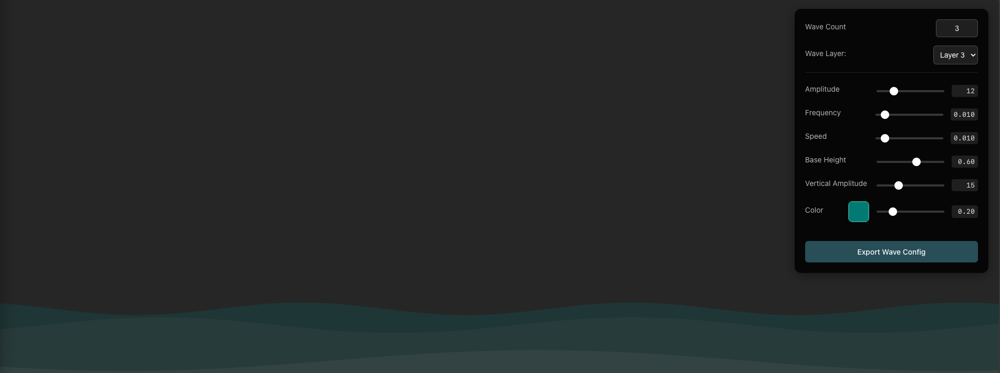

# Animated Wave Background

A lightweight, customizable animated wave background using HTML5 Canvas. Create beautiful, interactive wave effects with multiple layers, parallax movement, and real-time configuration.



## Features

- 🌊 Smooth, animated waves with configurable properties
- 🎨 Multiple wave layers with independent controls
- 📱 Responsive and performance optimized
- 🎛️ Real-time configuration panel
- 💫 Parallax effect support
- 🎯 Zero dependencies

## Quick Start

1. Import the required files:

```javascript
import { Waves } from "./components/Waves";
import { WaveControls } from "./components/WaveControls"; // Optional
```

2. Create a container and initialize the waves:

```javascript
// Create container
const container = document.createElement("div");
container.style.cssText = `
  position: fixed;
  bottom: 0;
  left: 0;
  width: 100vw;
  height: 300px;
  z-index: 1;
  background: transparent;
  overflow: hidden;
`;
document.body.appendChild(container);

// Initialize waves
const waves = new Waves({
  container,
  waves: [
    {
      amplitude: 20,
      frequency: 0.01,
      speed: 0.02,
      color: "rgba(128, 128, 128, 0.2)",
      baseHeight: 0.85,
      verticalAmplitude: 8,
      parallaxFactor: 1.0,
    },
    {
      amplitude: 15,
      frequency: 0.008,
      speed: 0.015,
      color: "rgba(128, 128, 128, 0.15)",
      baseHeight: 0.7,
      verticalAmplitude: 12,
      parallaxFactor: 0.7,
    },
  ],
});
```

3. (Optional) Add the configuration panel:

```javascript
const waveControls = new WaveControls(waves);
```

## Wave Configuration

Each wave layer can be configured with the following properties:

| Property          | Type   | Default                   | Description                             |
| ----------------- | ------ | ------------------------- | --------------------------------------- |
| amplitude         | number | 20                        | Height of the wave                      |
| frequency         | number | 0.02                      | How many waves appear across the width  |
| phase             | number | 0                         | Starting position offset                |
| speed             | number | 0.05                      | How fast the wave moves                 |
| color             | string | "rgba(33, 150, 243, 0.6)" | Wave color with transparency            |
| baseHeight        | number | 0.6                       | Vertical position (0 = top, 1 = bottom) |
| verticalAmplitude | number | 10                        | Vertical movement amount                |
| verticalFreq      | number | 0.02                      | Speed of vertical movement              |
| verticalPhase     | number | 0                         | Vertical movement offset                |
| heightScale       | number | 1.0                       | Overall height multiplier               |
| parallaxFactor    | number | 1.0                       | Movement speed relative to other layers |

## Dynamic Updates

You can update wave parameters in real-time:

```javascript
// Update a single wave's parameters
waves.setWaveParameters(0, {
  amplitude: 30,
  frequency: 0.03,
  speed: 0.06,
});

// Replace all wave configurations
waves.setWaves([
  {
    amplitude: 25,
    frequency: 0.015,
    speed: 0.025,
    color: "rgba(128, 128, 128, 0.3)",
    baseHeight: 0.8,
  },
]);
```

## Adding to Existing HTML

1. Add the container to your HTML:

```html
<div
  id="waves-container"
  style="position: fixed; bottom: 0; left: 0; width: 100vw; height: 300px; z-index: 1; overflow: hidden;"
></div>
```

2. Initialize in your JavaScript:

```javascript
const waves = new Waves({
  container: document.getElementById("waves-container"),
  waves: [
    {
      amplitude: 20,
      frequency: 0.01,
      speed: 0.02,
      color: "rgba(128, 128, 128, 0.2)",
      baseHeight: 0.85,
    },
  ],
});
```

## Performance Tips

1. Adjust wave count based on device performance
2. Use `parallaxFactor` to create depth without extra layers
3. Keep `frequency` values low for smoother animations
4. Use `rgba` or `hsla` colors with low opacity for better blending

## Browser Support

- Chrome (latest)
- Firefox (latest)
- Safari (latest)
- Edge (latest)

## License

MIT License - feel free to use in personal and commercial projects.
